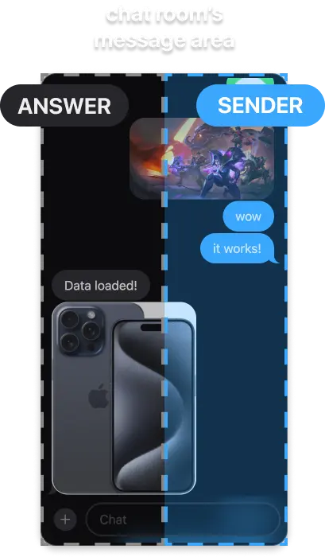

# ios-chat

[](https://www.npmjs.com/package/ios-chat?activeTab=readme) 

[demo](https://keepgo-studio.github.io/example-ios-chat-next/)

<p align="center">
  
</p>

Small Library to show chat UI as iOS style

You can easily style your chatbot or chat system with "ios-chat"

currently, all the library's functions only works at browser (not support SSR)

---

### Contents

- [Setup](#setup)
  + [using npm](#using-npm)
  + [using script](#using-script)
- [Basic Concepts](#basic-concepts)
   * [attributes](#attributes)
      + [example on html](#example-on-html)
   * [Precautions](#precautions)
- [API](#api)
   * [functions](#functions)
      + [sendChat (async)](#sendchat-async)
      + [answerChat (async)](#answerchat-async)
      + [startAnswerLoading](#startanswerloading)
      + [endAnswerLoading (async)](#endanswerloading-async)
      + [isBlocked](#isblocked)
      + [getMessages](#getmessages)
      + [initChat](#initchat)
      + [addRoomListener](#addroomlistener)
      + [removeRoomListener](#removeroomlistener)
   * [types](#types)
      + [ChatMessage](#chatmessage)
      + [SendInfo](#sendinfo)
- [Examples](#examples)
- [Issues](#issues)

---

# Setup

### using npm

```bash
  npm install ios-chat
```

```js
  import { addRoomListener, answerChat } from "ios-chat";
```

### using script

```html
  <!-- esm module -->
  <script src="https://unpkg.com/ios-chat/dist/esm/index.js"></script>

  <!-- umd module -->
  <script src="https://unpkg.com/ios-chat/dist/umd/index.js"></script>
```

```html
<ios-chat room-id="example"></ios-chat>

<script>
  Chat.addRoomListener("example", (msg) => {
    // ...
  });
</script>
```

# Basic Concepts

ios-chat is just using Web Components API, so you can attach everywhere inside of body with predefined tag name, `<ios-chat>`

## attributes

1. room-id: `string` (required)
  
    Chat room ID, it is necessary to use API since the library configured chat room with room-id

    **⭐️important note** - all chat rooms can be handled after the tag is attached at DOM. Literally, The [functions below](#functions) will work after the tags are added inside of body tag.

2. dark: `boolean` (optional)

    The attribute for setting dark mode

    if it is `true`, **dark** mode appeared

    default value is `false`

3. textonly: `boolean` (optional)

    The attribute for setting input mode

    if it is `true`, the sender can only send string messages

    default value is `false`

### example on html

```html
<ios-chat room-id="chat" dark="true"></ios-chat>

<!-- only string sending -->
<ios-chat room-id="chat" dark="true" textonly></ios-chat>
```

## Precautions

1. answer and sender UI

    Don't be confused while using [answerChat( )](#answerchat) and [sendChat( )](#sendchat)

<p align="center">
  
</p>

2. all images and audio are created with URL.createObjectURL( );

    so all of them are just temporary data, if you want to know how to save data to server or other storage, check [next js + ios-chat](https://github.com/keepgo-studio/example-ios-chat-next)

3. `<ios-chat>` has z-index a maximal of 10


# API

## functions

### sendChat (async)
```ts
async function sendChat(roomId: string, info: SendInfo);
```

- if chat room is [blocked](#isblocked), throw error

- send chat message to room, check [SendInfo](#sendinfo)

- it return Promise that has same duration with **message animation duration**
  
  so if you don't want to override animation, wait this Promise

### answerChat (async)
```ts
async function answerChat(roomId: string, info: SendInfo);
```

- if chat room is [blocked](#isblocked), throw error

- answer chat message to room, check [SendInfo](#sendinfo)

- it return Promise that has same duration with **message animation duration**
  
  so if you don't want to override animation, wait this Promise

### startAnswerLoading
```ts
function startAnswerLoading(roomId: string);
```

- if chat room is [blocked](#isblocked), throw error

- start loading for room

- the [blocked](#isblocked) value will be true

### endAnswerLoading (async)
```ts
async function endAnswerLoading(roomId: string);
```
- end loading for room

- the [blocked](#isblocked) value will be false

### isBlocked
```ts
function isBlocked(roomId: string): boolean;
```

- return status, as boolean, for roomId

### getMessages
```ts
function getMessages(roomId: string): ChatMessage[];
```

- get all message list from chat room

### initChat
```ts
function initChat(roomId: string, messages: ChatMessage[]);
// e.g
initChat("example", messages);
```

- init room with message list 

  this won't show message animation

### addRoomListener
```ts
function addRoomListener(roomId: string, callback: ListenerCallback): string;

// e.g
const listenerId = addRoomListener("example", (msg: ChatMessage) => {
  if (msg.type === "text")
    alert(msg.content)
});
```
- with this function, you can listen recent message(type [`ChatMessage`](#chatmessage)) from chat room

- the function get recent message except `loading` type message (message from [startAnswerLoading](#startanswerloading))

- the function return listener id which will use at [removeRoomListener](#removeroomlistener)

### removeRoomListener
```ts
function removeRoomListener(roomId: string, listenerId: string);

// e.g
removeRoomListener("example", listenerId);
```


## types

### ChatMessage

```ts
type ChatMessage = {
  type: ChatMessageType; // 'text' | 'img' |'audio' | "loading"
  role: Role; // 'sender' | 'receiver'
  id: string;
  createdDatetime: number;
  content: string;
  origin?: string; // room-id string
};
```

- if one chat room send message to other room, the origin will be stored.

### SendInfo

```ts
type SendInfo = {
  type: ChatMessageType; // 'text' | 'img' |'audio' | "loading"
  content: string;
  origin?: string;
}
```

# Examples

[next js + ios-chat](https://github.com/keepgo-studio/example-ios-chat-next)

[vanilla JS + ios-chat](https://keepgo-studio.github.io/ios-chat/)

# [Issues](https://github.com/keepgo-studio/ios-chat/issues)
